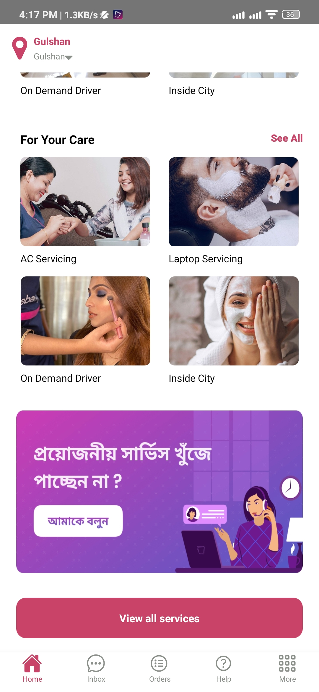

# Sheba App Clone (Homepage) With React Native

I have made a Sheba App clone. I was quite easy and I enjoyed while making it.

To try the app run the following
`npm install`  
`npm start` and `npx react-native run-android` 

## Some Snapshots

<!--  -->
<!--  -->

<table>
    <tr>
        <td></td>
        <td></td>
        <td></td>
        <td></td>
    </tr>
</table>

### The whole page

