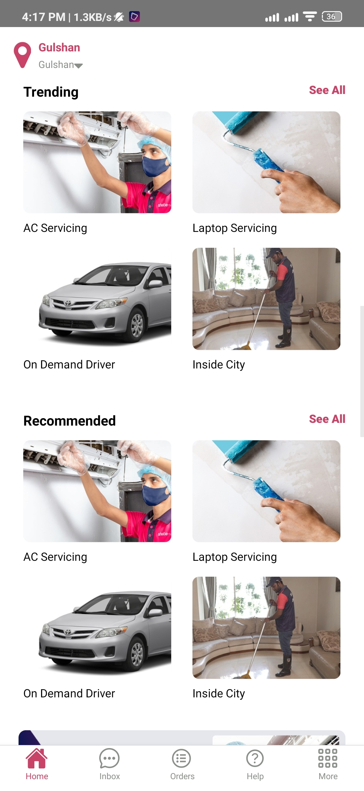

# Sheba App Clone (Homepage) With React Native
I have made a Sheba App clone. I was quite easy and I enjoyed while making it.

To try the app 
`npm install`
`npm start` and `npx react-native run-android`

## Some Snapshots

<!--  -->

<table>
    <tr>
        <td align="center"></a></td>
        <td align="center"></a></td>
        <td align="center"></a></td>
        <td align="center"></a></td>
        
        
    </tr>
</table>
<table>
